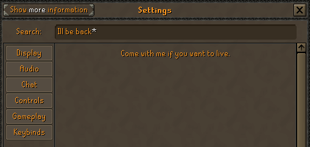

# Custom Settings Easter Eggs
Allows you to set up custom Easter eggs for the reworked settings interface.



## Usage
In the plugin's config, simply add your eggs in the following format:
```
Easter egg search term => Easter egg text
```

Separate your entries on new lines:
```
Text 1 => Egg 1
Text 2 => Egg 2
```

Define alternate search terms for the same Easter egg:
```
Text1 & Text2 & Text3 => Egg
```

As the Easter egg text is used as-is, you can use the following text tags that the client understands:
* `<br>` will break the text into a new line.
* `<lt>` and `<gt>` will turn into `<` and `>` respectively.
* `<col=######>text</col>` will change the text color to the given RGB hex code. Simply replace the `######` with the desired color code.
* `` will add one of the various chat icons. For example, `` is a player moderator icon, `1` a Jagex moderator icon, `2` an ironman icon, etc.

## Current Limitations
* The plugin will only apply custom Easter eggs if the search result returns the default "Nothing Found" message.
